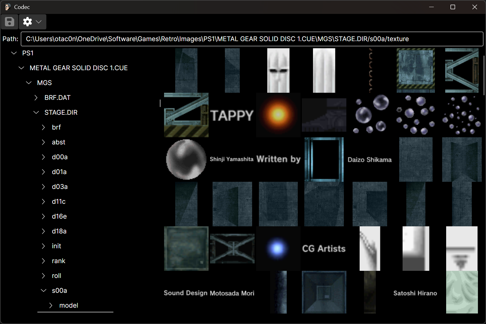
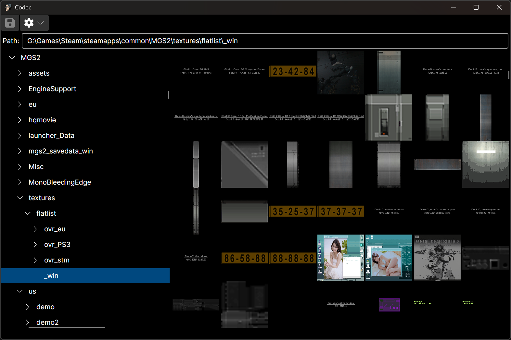
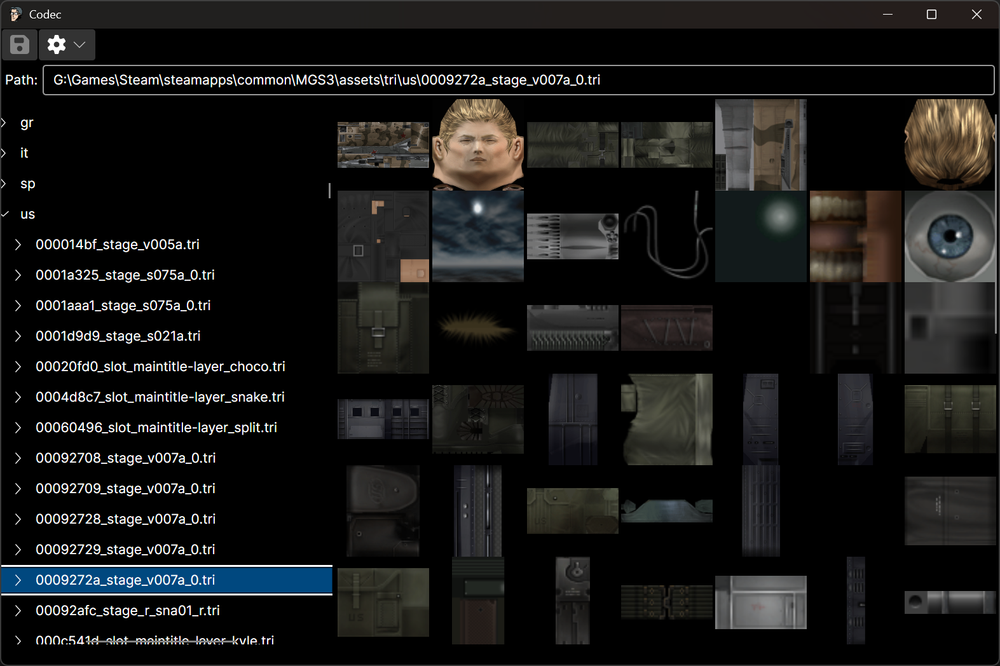
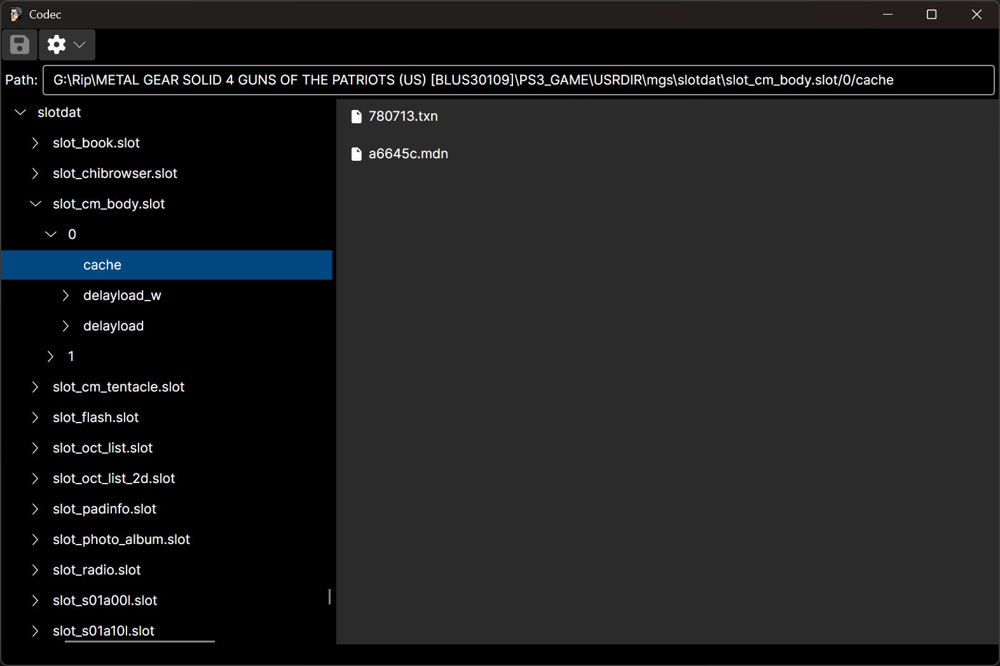
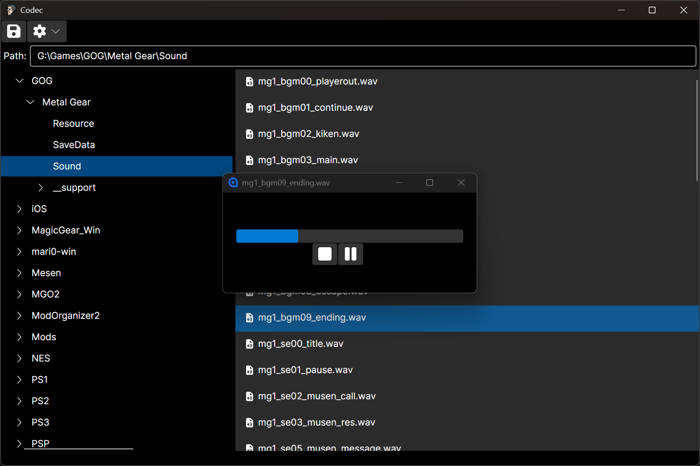
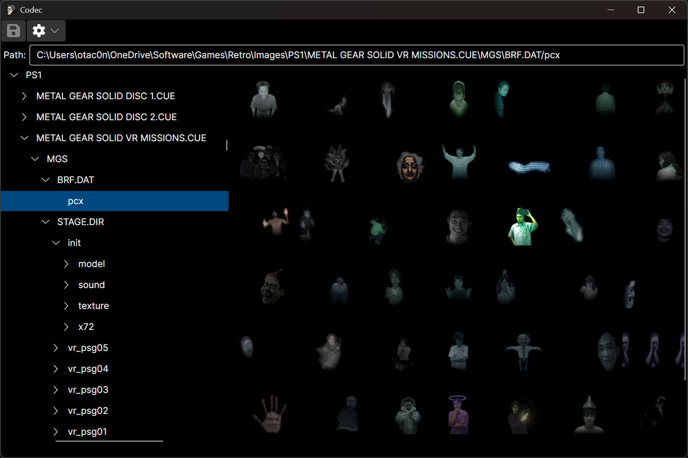

Codec
=======

Asset browser for Metal Gear Solid games (and others).
This project is licensed under the [GPL v3](LICENSE.md) license.

Support for the following formats is implemented:

- Archives
  - Generic
    - .iso Images
    - .bin/cue Images
  - Metal Gear Specific
    - M2 Archive (Master Collection v1)
      - .psb.m Packaging Format
    - STAGE.DAT Archive (MGS1 & MGSVR)
    - .brf Briefing Files (MGS1 & MGSVR)
    - .slot Data Files (MGS4)
- Files
  - Generic
    - CD Audio Tracks
    - All Basic Image Formats (PNG, JPEG, BMP, etc.)
    - WAV & MP3 Audio Files
    - .pcx Image Files
  - Metal Gear Specific
    - .tri Texture Files (MGS2 & MGS3)
    - .ctxr Texture Files (MGS2 & MGS3)

To view Master Collection resources, you will need to have a copy of the game on your system.  The tool will automatically detect the Steam location of the game, but you can browse to any location as desired.

Launch the tool using the key in the [launch settings](Codec.UI/Properties/launchSettings.json).

|||
|-|-|
|||
|||
|||

OpenSource Info
---------------

| Project | License | Details |
|---------|---------|---------|
| [Silk.NET](https://github.com/dotnet/Silk.NET) | [MIT](https://github.com/dotnet/Silk.NET/blob/main/LICENSE.md) | 3D rendering and windowing (coming soon) |
| [HIDDevices](https://github.com/DevDecoder/HIDDevices) | [Apache 2.0](https://github.com/DevDecoder/HIDDevices/blob/master/LICENSE.txt) | Device handling |
| [Magick.NET](https://github.com/dlemstra/Magick.NET) | [Apache 2.0](https://github.com/dlemstra/Magick.NET/blob/main/License.txt) | PCX loading |
| [System.IO.Abstractions](https://github.com/TestableIO/System.IO.Abstractions) | [MIT](https://github.com/TestableIO/System.IO.Abstractions/blob/main/LICENSE) | Nested filesystems |
| [CueSharp](https://www.nuget.org/packages/CueSharp) | [BSD](https://www.nuget.org/packages/CueSharp/1.0.1/License) | CUE format |
| [DiscUtils](https://github.com/DiscUtils/DiscUtils) | [MIT](https://github.com/DiscUtils/DiscUtils/blob/develop/LICENSE.txt) | ISO format |
| [GMWare.M2](https://gitlab.com/modmyclassic/sega-mega-drive-mini/marchive-batch-tool) | [GPL 3.0](https://gitlab.com/modmyclassic/sega-mega-drive-mini/marchive-batch-tool/-/blob/master/COPYING) | M2 Archive format |
| [MGS1-TOOLS](https://github.com/MSylvia/MGS1-TOOLS) | | Reference code |
| [mgs_reversing](https://github.com/FoxdieTeam/mgs_reversing) | | Reference code |
| [CtxrTool](https://github.com/Jayveer/CtxrTool) | [MIT](https://github.com/Jayveer/CtxrTool/blob/master/README.md) | Reference code |
| [MGS-Master-Collection-Noesis](https://github.com/Jayveer/MGS-Master-Collection-Noesis) | | Reference code |
| [Solideye](https://github.com/Jayveer/Solideye/tree/master) | | Reference code |
| [Metal Gear Master Collection](https://store.steampowered.com/app/2131630/METAL_GEAR_SOLID__Master_Collection_Version/) | Non-transferrable | You need your own license to this software, and your license may not cover this usage. |
| [Digital-7 Font](http://style7.website/font.php?font=digital-7) | Freeware for home use | Frequency display (coming soon) |
| [Font Awesome Free Icons](https://fontawesome.com/icons) | [CC BY 4.0](https://fontawesome.com/license/free) | Used for UI icons |
